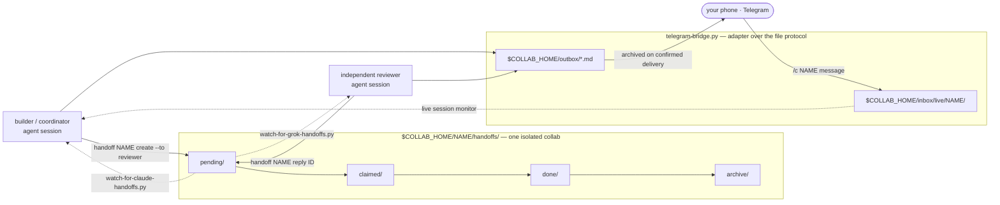

# collab-kit

A lone agent self-certifies. It writes the change, reads its own diff, declares it correct, and
ships the subtle bug — because the thing that would have caught it is an *independent* pair of eyes
with real repo access, and it didn't have one. **collab-kit** is the file-based orchestration layer
that gives it one: two agent seats (a **builder/coordinator** and an **independent reviewer**), a
handoff protocol made of plain markdown files on disk, watchers so each side gets pinged the moment
the other needs something, an adversarial regression hunt for high-stakes diffs, and an optional
Telegram bridge so you stay in the loop from your phone. It is **agent-agnostic** — two Claude Code
instances, Claude + Grok, or any CLI agent that can read/write files and run shell commands. The
value isn't agent *count*, it's review depth plus staying reachable.

Design rationale lives in **[ARCHITECTURE.md](ARCHITECTURE.md)**. This README is the operator's
manual.

---

## How it fits together



Edges into `pending/`, `outbox/`, and `inbox/live/` are file writes; dashed edges are watchers
tailing a directory. The two legs touching Telegram are the bridge's long-poll network calls — the
only network hop in the picture. Nothing is held in a daemon's memory: the entire state of a collab
is what's on disk, which makes it inspectable, crash-safe, and trivially resumable.

---

## Quickstart

Copy-pasteable end to end. Replace the `--repo` URL with the repository you actually want worked on.

```bash
# 1 — get the kit
git clone <this-repo-url> collab-kit
cd collab-kit

# 2 — install: symlinks the CLI into ~/bin, writes COLLAB_HOME into your shell rc,
#     and (for Claude Code users) installs the /collab skill
./install.sh
source ~/.bashrc

# 3 — scaffold + register an isolated collab, clone the target repo,
#     render PROTOCOL.md / REVIEWER-BRIEFING.md / KICKOFF.md / context/IDEA.md
newproject demo --repo https://github.com/you/your-project.git --reviewer grok
```

Now start one watcher per seat, each in its own terminal. Run these from the kit directory (or use
absolute paths — `$KIT_DIR/tools/...` works from anywhere).

```bash
# terminal 2 — builder side
HANDOFF_ROOT=$COLLAB_HOME/demo python3 tools/watch-for-claude-handoffs.py

# terminal 3 — reviewer side
HANDOFF_ROOT=$COLLAB_HOME/demo python3 tools/watch-for-grok-handoffs.py
```

Back in terminal 1, send the first handoff and check where everything stands:

```bash
cat > /tmp/review-request.md <<'EOF'
Please review the auth refactor on branch `refactor/auth`.

Focus: session invalidation on password change, and the new token TTL math.
Do not take my summary at face value — read the diff.
EOF

handoff demo create --to reviewer \
  --title "Review the auth refactor" \
  --priority high \
  --file /tmp/review-request.md

handoff status        # cross-project overview: what's outstanding, and where
```

The reviewer's watcher fires, the reviewer runs `handoff demo claim <id>` and
`handoff demo show <id>`, does the work, and closes with `handoff demo done <id> --note "…"` or
replies with `handoff demo reply <id> --title "…" --file findings.md`.

Optional, once you have a bot token:

```bash
export TELEGRAM_BOT_TOKEN=123456:AA...   # from @BotFather
python3 tools/telegram-bridge.py
```

---

## Handoff protocol

Communication between the two seats is **markdown files with YAML frontmatter**, moving through
per-collab state directories. There is no queue server, no socket, no database.

```
$COLLAB_HOME/<name>/handoffs/
    pending/   →   claimed/   →   done/   →   archive/
```

| Directory   | Meaning                                                                 |
|-------------|-------------------------------------------------------------------------|
| `pending/`  | Written by the sender. This is what the receiving side's watcher tails.  |
| `claimed/`  | The receiving seat has picked it up and owns it (`handoff <name> claim`). |
| `done/`     | Finished, with an optional closing note (`handoff <name> done`).         |
| `archive/`  | Swept out of the active view by `handoff <name> archive`.                |

### Handoff file shape

```markdown
---
id: 2026-07-27-1432-review-auth-refactor
to: reviewer
from: builder
title: Review the auth refactor
priority: high
created: 2026-07-27T14:32:11Z
collab: demo
thread: 2026-07-27-1101-auth-refactor-kickoff
tags: [auth, security]
---

Please review the auth refactor on branch `refactor/auth`.
...
```

| Field      | Purpose                                                                        |
|------------|--------------------------------------------------------------------------------|
| `id`       | Stable identifier; what you pass to `claim` / `show` / `done` / `reply`.        |
| `to`       | Destination seat — the side whose watcher should surface this.                  |
| `from`     | Originating seat.                                                               |
| `title`    | One-line subject, shown in `handoff list` and `handoff status`.                 |
| `priority` | `low` · `normal` · `high` · `urgent`.                                           |
| `created`  | Creation timestamp.                                                             |
| `collab`   | Which collab this belongs to — the registry key.                                |
| `thread`   | The `id` this is a reply to, so a back-and-forth stays linked.                  |
| `tags`     | Free-form labels for filtering (e.g. the risk areas that trigger a hunt).       |

### CLI

`handoff` is the registry-aware front door — it takes a collab name and resolves it via
`collabs.json`. `collab-handoff` is the same surface scoped to a single collab via `$HANDOFF_ROOT`,
which is what an agent session inside one collab uses.

```
handoff <name> create --to <seat> --title "…" [--priority low|normal|high|urgent] [--file body.md | --body "…" | -]
handoff <name> list [--pending|--claimed|--done|--all] [--to <seat>] [--json]
handoff <name> claim <id>
handoff <name> show <id>
handoff <name> done <id> [--note "…"]
handoff <name> reply <id> --title "…" --file body.md
handoff <name> archive [<id>|--all-done]
handoff <name> counts              # one line per state
handoff <name> path [--repo|--pending|--logs]   # print a path, for scripting
handoff <name> log [-n <count>]    # recent lifecycle events (JSONL audit trail)
handoff status                     # cross-project overview
handoff collabs                    # list registered collabs
handoff doctor                     # health check; non-zero exit if anything is broken
handoff new <name>                 # scaffold + register an isolated collab
handoff register <name> --root <path> [--force]
handoff unregister <name>          # forget it; files on disk are left alone
handoff prune                      # drop registry entries whose collab is gone
newproject <name> --repo <git-url> --reviewer claude|grok
restart <name>
```

Inside a session pinned to one collab (`$HANDOFF_ROOT` set), use **`collab-handoff <cmd>`** —
same verbs, no collab-name argument. It also works on a collab that was never registered.

Ids may be abbreviated to any unambiguous prefix; an ambiguous prefix is an error, never a
coin flip. Exit codes are part of the contract: `0` ok, `2` usage, `3` not found, `4` conflict
(you lost a claim race), `5` lock timeout, `6` validation.

`--file body.md`, `--body "…"`, and `-` (read the body from stdin) are three ways to supply the same
thing; `--json` on `list` gives you machine-readable output for scripting.

### Isolation

A JSON registry (`collabs.json`) maps collab names to roots. Every collab is fully isolated — its
own `handoffs/`, `logs/`, locks, and `context/` — so concurrent collabs cannot race or
cross-contaminate.

---

## Watchers

Each side runs a persistent monitor that tails its `pending/` directory and surfaces new handoffs
in-session, so the reviewer is pinged the moment the builder requests a review, and vice versa.

```bash
# builder side — one collab
HANDOFF_ROOT=$COLLAB_HOME/<name> python3 tools/watch-for-claude-handoffs.py

# reviewer side — one collab
HANDOFF_ROOT=$COLLAB_HOME/<name> python3 tools/watch-for-grok-handoffs.py

# optional always-on alert watcher — fans events across EVERY registered collab
python3 tools/watch-all-handoffs.py
```

The two per-seat watchers are scoped by `$HANDOFF_ROOT` and know nothing about other collabs.
`watch-all-handoffs.py` covers every *registered* collab instead, so nothing sits unseen in one you
aren't currently staring at.

These are the plain foreground commands. When you launch a watcher from inside an agent session,
wrap it in whatever that session uses to run a long-lived background process — ARCHITECTURE.md
writes it as `HANDOFF_ROOT=… monitor python3 tools/watch-for-claude-handoffs.py`.

---

## Phone bridge (Telegram)

`tools/telegram-bridge.py` is a zero-dependency bridge — stdlib `urllib` long-polling, nothing to
install — sitting on top of a dead-simple file protocol:

```
agents write   $COLLAB_HOME/outbox/*.md               → forwarded to your Telegram chat
you send       /c <project> <message>   (Telegram)    → $COLLAB_HOME/inbox/live/<project>/from-user-*.md
                                                        (the live session's monitor picks it up)
```

**Bring your own bot.** Create one with [@BotFather](https://t.me/BotFather) and export the token:

```bash
export TELEGRAM_BOT_TOKEN=123456:AA...      # required
export TELEGRAM_CHAT_ID=987654321           # optional — pin the bridge to one chat
python3 tools/telegram-bridge.py
```

`TELEGRAM_BOT_TOKEN` is required. `TELEGRAM_CHAT_ID` is optional: without it the bridge
learns-and-locks to the first chat id it sees; set it explicitly if your bot is public so it locks
to the chat you intend. `/c <project>` names are slug-sanitized against path traversal, and outbox
files are archived only on **confirmed** delivery — a failed send leaves the message queued rather
than silently dropping it.

Because it is only an adapter over the file protocol, swapping in Slack/Discord/anything else means
writing a different adapter over the same `outbox/` + `inbox/live/` directories. Telegram is
optional — the core handoff loop works without it.

---

## Adversarial regression hunt

For any high-stakes diff — **money · safety · data-integrity · auth · concurrency** —
`tools/diff-regression-hunt.workflow.js` runs a workflow that pipelines over fix-areas:

```
for each fix-area:
   probe   → a "breaker" agent tries to break THIS change (parallel across areas)
   verify  → each finding handed to an INDEPENDENT verifier that tries to REFUTE it
             (default: reject unless it can point to the exact code path + a concrete trigger)
→ return { confirmed, refuted }
```

Adversarial *generation* plus adversarial *verification*. The verification step is the part that
matters: it kills the plausible-but-wrong findings that make naive "ask an LLM to review this"
useless.

```js
Workflow({ scriptPath: "tools/diff-regression-hunt.workflow.js",
           args: { repo, diffPath, guardrails, areas } })
```

It runs **in parallel with** the human-style reviewer, not instead of it — two independent lenses
catch what one misses. It is **risk-triggered**, so a typo doesn't spend a fleet of agents; it is
parameterized per project with that project's sacred guardrails; and it is baked into every
generated `PROTOCOL.md`.

---

## Bootstrapping

```bash
newproject <name> --repo <git-url> --reviewer claude|grok
```

Scaffolds and registers an isolated collab, clones the target repo, renders the per-project
templates from `tools/collab-kit/` — `PROTOCOL.md`, `REVIEWER-BRIEFING.md`, `KICKOFF.md`,
`context/IDEA.md` — with the **guardrails written fresh per project, never inherited**, and prints
the session bootstrap block you paste into each agent.

`restart <name>` is the resume path for a collab that already exists — use it after a crash or a
reboot rather than re-running `newproject`. Because all state is on disk, resuming is just
re-reading it; there is no daemon to recover.

Scripts **self-locate** (`KIT_DIR` via `readlink`/`__file__`, `COLLAB_HOME` overridable by env), so
the kit runs under any user or path. `install.sh` symlinks the CLI into `~/bin`, writes
`COLLAB_HOME` into your shell rc, and — for Claude Code users — installs a `/collab` skill
(`skills/collab/SKILL.md`) that is the agent-side front door.

---

## Layout

The kit (this repository — clone it anywhere):

```
collab-kit/
  ARCHITECTURE.md                   # the design doc
  README.md  .gitignore  install.sh  collabs.json.example
  bin/newproject  bin/restart                      # bash
  tools/
    handoff                         # python3 CLI, registry-aware front door
    collab-handoff                  # python3 CLI, single-collab, scoped by $HANDOFF_ROOT
    watch-for-claude-handoffs.py    # builder-side watcher
    watch-for-grok-handoffs.py      # reviewer-side watcher
    watch-all-handoffs.py           # cross-collab alert watcher
    telegram-bridge.py              # stdlib-only Telegram long-poll bridge
    diff-regression-hunt.workflow.js
    collabkit/                      # stdlib-only python package (the shared core)
    collab-kit/                     # per-project markdown TEMPLATES
  skills/collab/SKILL.md            # Claude Code `/collab` skill
  tests/                            # python stdlib unittest suite
  scripts/check-workflow.mjs        # Workflow syntax gate (pnpm run check:workflow)
  .github/workflows/ci.yml
  package.json  pnpm-lock.yaml      # dev toolchain only — zero dependencies
  .npmrc  .node-version
```

Your data (`$COLLAB_HOME` — defaults to the kit dir, override via env):

```
$COLLAB_HOME/
  collabs.json                      # registry: collab name → root path
  <name>/                           # one fully isolated collab
    PROTOCOL.md                     # rendered per project, with fresh guardrails
    REVIEWER-BRIEFING.md
    KICKOFF.md
    context/                        # IDEA.md and other per-project context
    handoffs/
      pending/  claimed/  done/  archive/
    repo/                           # the target repo, cloned here by `newproject`
    logs/                           # this collab's watcher state and locks
  outbox/                           # agents → you   (the Telegram bridge drains this)
  inbox/live/<project>/             # you → agents   (from-user-*.md)
  logs/                             # bridge state, cross-collab watcher state, locks (gitignored)
```

When `COLLAB_HOME` defaults to the kit dir, that runtime state lands inside this repository — which
is exactly why `collabs.json`, `logs/`, `outbox/`, and `inbox/` are gitignored here.

---

## Requirements

- **Bash**
- **Python 3.14** — pinned exactly, not a floor. Older interpreters are refused at startup by
  `handoff`, `collab-handoff`, `newproject` and `install.sh`.
- **Git**
- **At least one agent CLI** — Claude Code and/or Grok — authenticated the normal way
- **Optional:** a Telegram bot (a @BotFather token) for the phone channel

Still no third-party Python packages, and none are ever added — the runtime dependency list is
"Python 3.14 and nothing else".

The regression-hunt workflow is executed by your agent's `Workflow(...)` runtime, not by a
standalone `node` you install.

### Development-only: Node + pnpm

Contributors additionally need **Node 22+** and **pnpm 11+** to run the repo's checks. This is
tooling, not a runtime dependency: nothing in `tools/`, `bin/` or `install.sh` shells out to Node,
and the package has **zero dependencies** — pnpm is here to pin the toolchain and give the checks
one entry point.

```bash
corepack enable                # or: npm i -g pnpm
pnpm install --frozen-lockfile
pnpm check                     # workflow syntax + full Python suite
```

Explicitly:

- **No third-party Python packages.** Everything is stdlib. There is no `requirements.txt`, no
  virtualenv step, and nothing to `pip install`.
- **The kit does not provide agent runtimes, model API keys, or any model proxy.** It sets up the
  *collaboration system*; you bring the agents and their credentials.

---

## Environment variables

| Variable             | Default                                        | Meaning                                                                                       |
|----------------------|------------------------------------------------|-----------------------------------------------------------------------------------------------|
| `COLLAB_HOME`        | the kit directory                              | Root of all your data: `collabs.json`, per-collab dirs, `outbox/`, `inbox/`, `logs/`. `install.sh` writes it into your shell rc. |
| `HANDOFF_ROOT`       | unset                                          | Scopes `collab-handoff` and the per-seat watchers to a single collab. Set it to `$COLLAB_HOME/<name>`. |
| `KIT_DIR`            | self-located (`readlink` / `__file__`)         | Where the kit code lives. Scripts resolve it themselves; set it only to override that.          |
| `TELEGRAM_BOT_TOKEN` | unset                                          | **Required** to run `telegram-bridge.py`. Your @BotFather token.                                |
| `TELEGRAM_CHAT_ID`   | unset (bridge learns-and-locks the first chat) | Pins the bridge to one chat id. Set explicitly for a public bot.                                |
| `NO_COLOR`           | unset                                          | Set to any value to disable ANSI colour in CLI output.                                          |

---

## Development

The test suite is Python stdlib `unittest`. There is nothing to install first.

```bash
# from the repository root
python3 -m unittest discover -s tests -t . -v
```

Run a single test module:

```bash
python3 -m unittest tests.test_frontmatter -v
```

Every shipped script must pass a syntax check before it lands:

```bash
bash -n install.sh bin/newproject bin/restart      # and any *.sh
```

`tools/diff-regression-hunt.workflow.js` is a **Workflow script, not a standalone Node module**: it
uses ESM `export` for its `meta` block *and* a top-level `return` to yield the result, because the
`Workflow(...)` runtime evaluates the file body inside a function. `export` is illegal in CommonJS
and top-level `return` is illegal in an ES module, so a bare `node --check` on the file cannot pass
either way. To syntax-check it, reproduce that shape first:

```bash
{ echo 'export default async function __check__() {'
  sed 's/^export default //; s/^export //' tools/diff-regression-hunt.workflow.js
  echo '}'; } > /tmp/check.mjs
node --check /tmp/check.mjs
```

[`.github/workflows/ci.yml`](.github/workflows/ci.yml) does exactly that, via `pnpm run
check:workflow`, so CI and your machine run the identical script rather than two copies of the
recipe that can drift. It also runs the test command above across Linux/macOS/Windows on Python
3.14 (no install step — the suite is stdlib-only), plus a lint job covering `bash -n`,
`shellcheck`, and `compileall`.

---

## Security notes

- **Agent output is treated as untrusted code.** That is the whole premise: verification is a
  first-class, parallel, independent step, not a courtesy read of the builder's own summary.
- **Names that become paths are slug-sanitized.** Collab names and the `<project>` argument of
  Telegram's `/c` command are sanitized against path traversal, so an inbound message cannot steer
  writes outside `$COLLAB_HOME/inbox/live/`.
- **The bridge locks to a single chat id.** It learns the first chat it sees and stays there; set
  `TELEGRAM_CHAT_ID` explicitly when the bot is publicly reachable.
- **Outbox files are archived only on confirmed delivery**, so a network failure queues a message
  rather than losing it.
- **`$COLLAB_HOME/logs/` is gitignored**, along with `collabs.json`, `outbox/`, and `inbox/` —
  runtime state and your private registry never end up in a commit. Only `collabs.json.example` is
  tracked.
- **You still hold the keys.** No model credentials pass through the kit.

---

See **[ARCHITECTURE.md](ARCHITECTURE.md)** for why it is built this way.
